

## CSS 426 ML Ops
### Lab - 2

---

- Name: Ankur Majumdar
- Roll No. 2022BCD0046

---

#### 1. GitHub Repository Link
- [github.com/2022BCD0046-ankur/lab2](https://github.com/2022bcd0046-ankur/lab2)

#### 2. Screenshots of Job Summary and Artifacts

- EXP-01: [Run Link](https://github.com/2022bcd0046-ankur/lab2/actions/runs/20863825104)

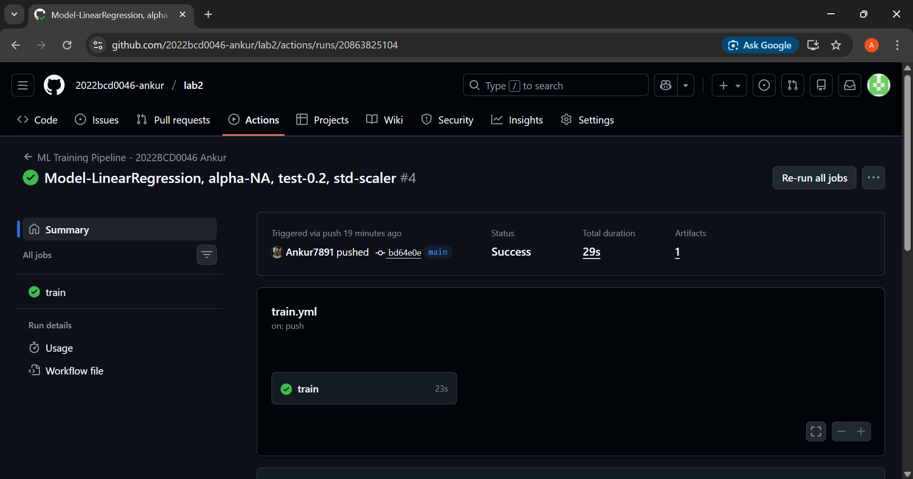

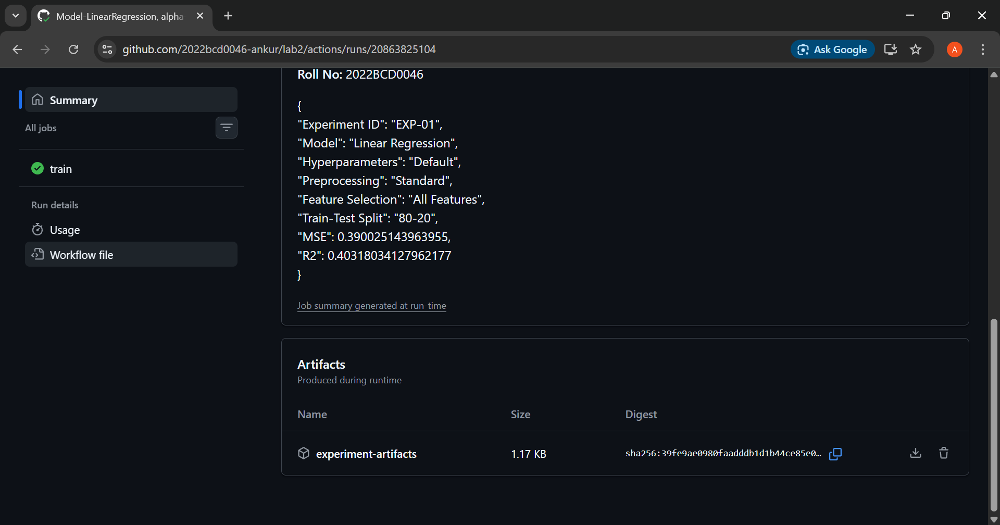

- EXP-02: [Run Link](https://github.com/2022bcd0046-ankur/lab2/actions/runs/20864554637)

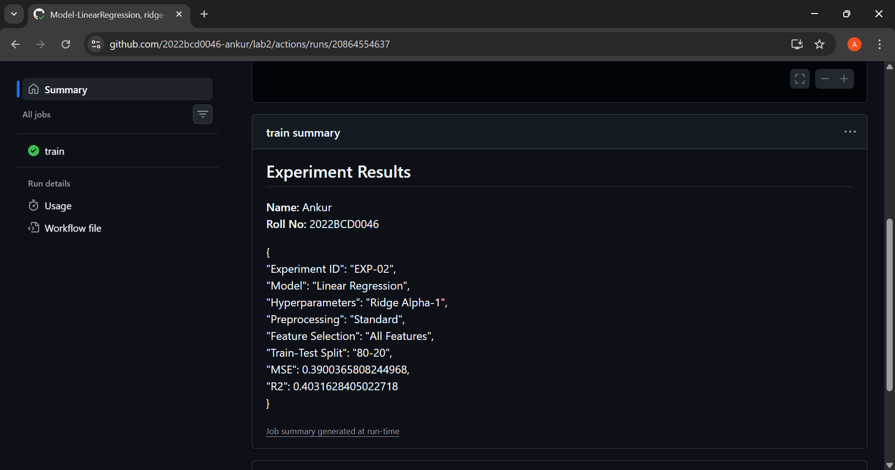
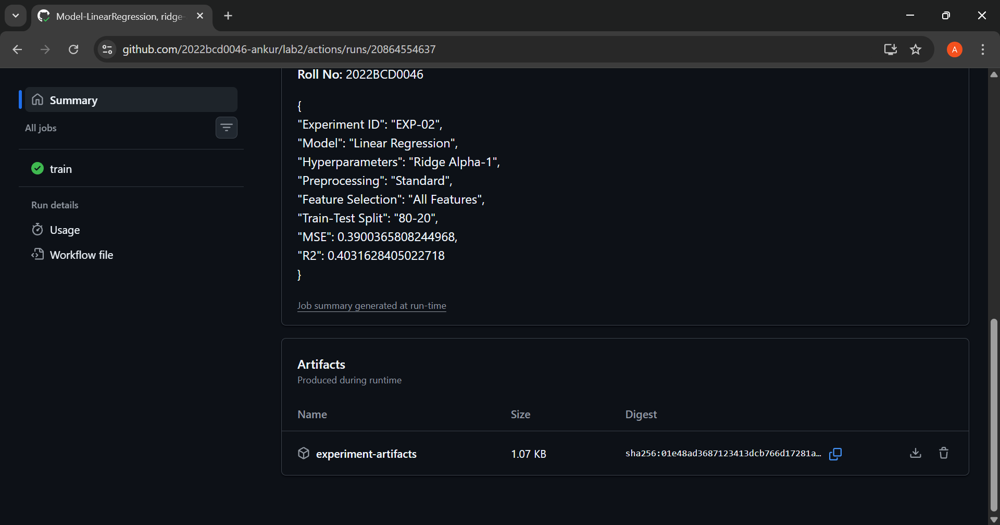

- EXP-03: [Run Link](https://github.com/2022bcd0046-ankur/lab2/actions/runs/20864739662)

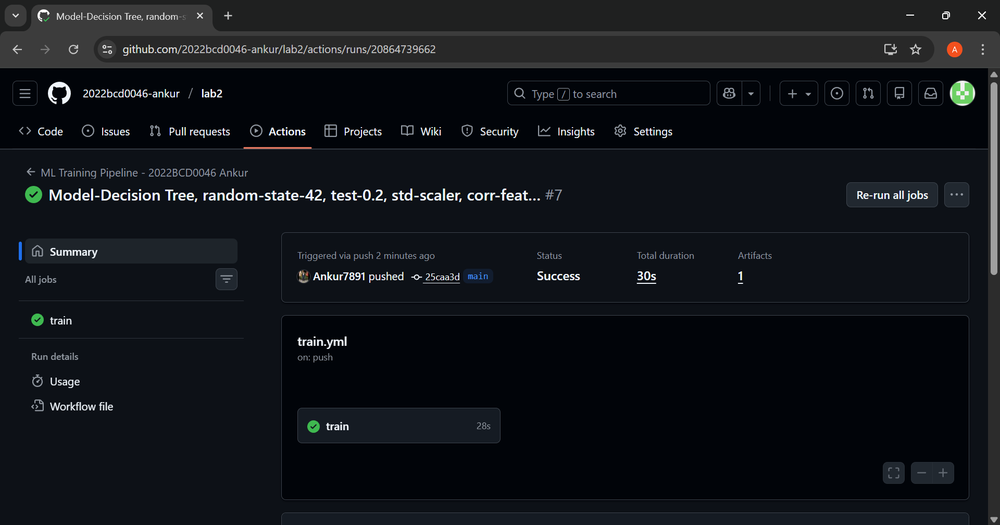
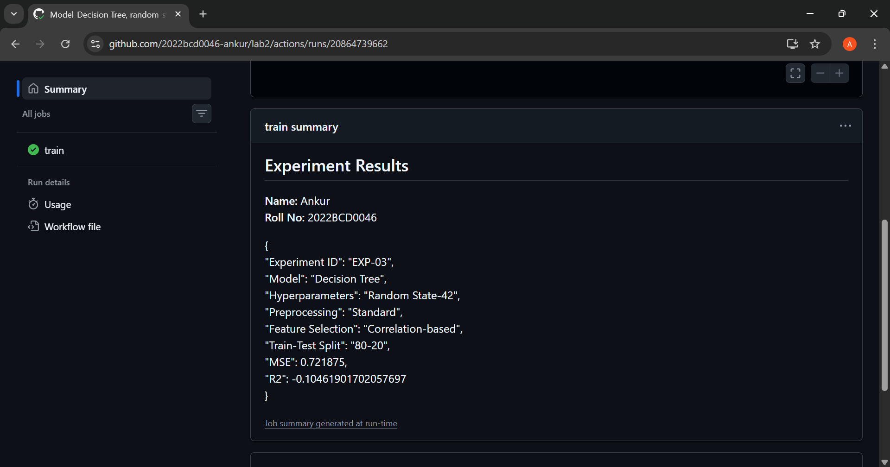
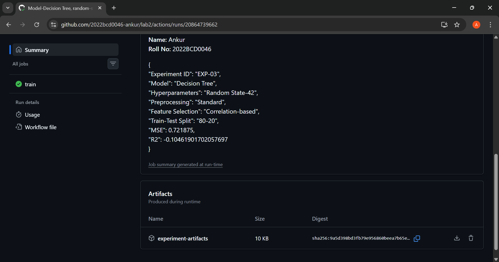

- EXP-04: [Run Link](https://github.com/2022bcd0046-ankur/lab2/actions/runs/20864892715)

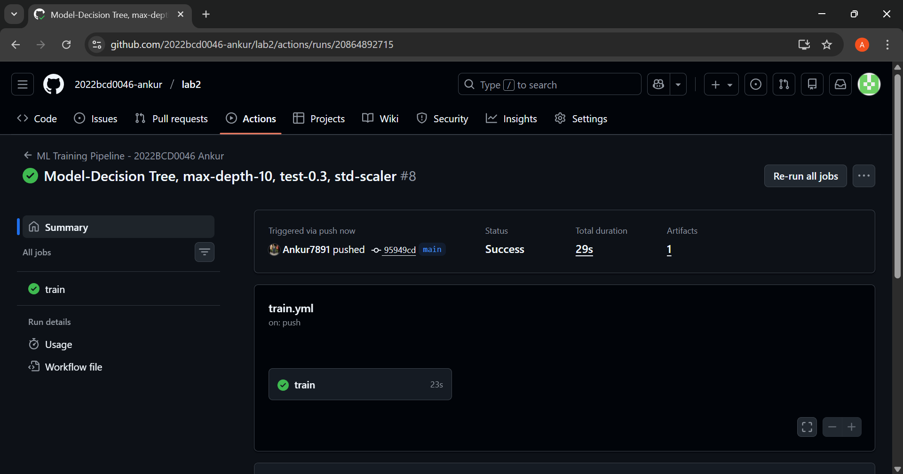
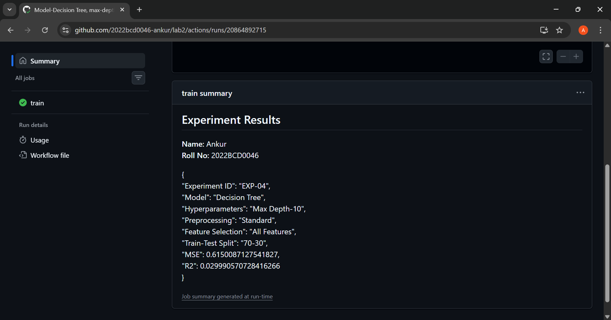
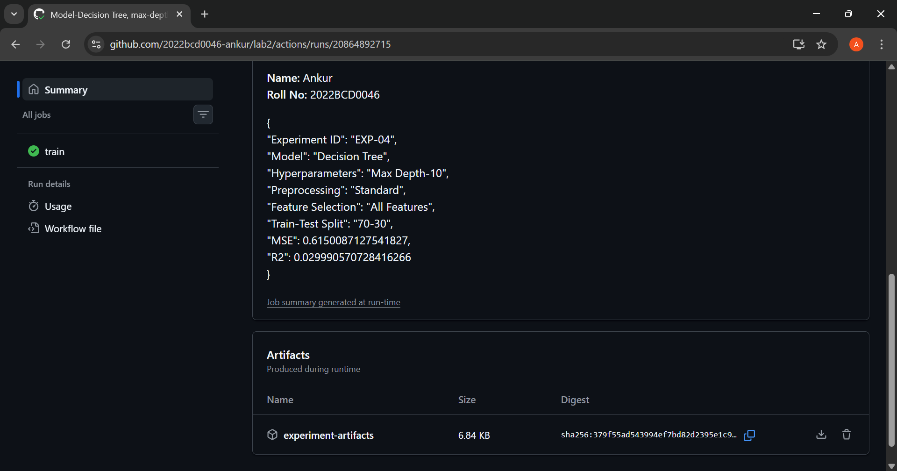

- Overall Runs...

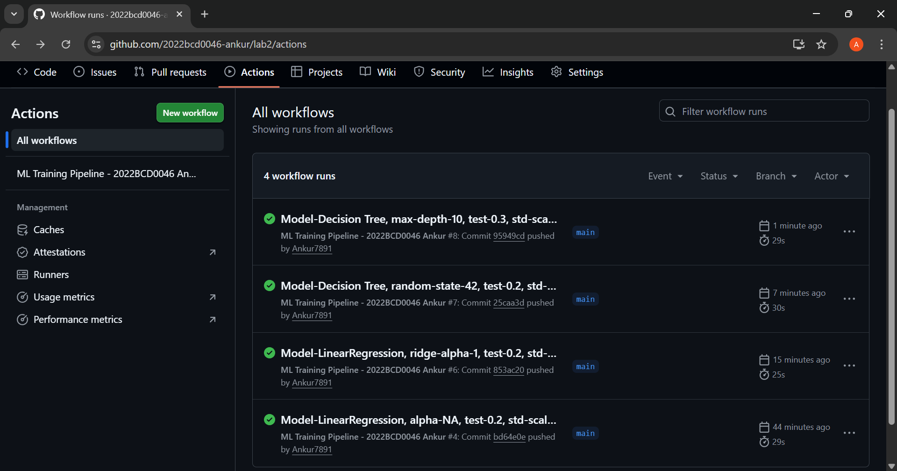

#### 3. Analysis Questions

1. How did GitHub Actions improve reproducibility?

- GitHub Actions ensured that every experiment ran in a fixed, automated environment with the same dependency versions and execution steps, making results reproducible across runs.

2. How easy was it to compare results across runs?

- Comparison was easy because each run produced metrics in the Job Summary and downloadable JSON artifacts, allowing side-by-side inspection.

3. What role does Git commit history play in experiment tracking?

- Each commit represents a unique experiment configuration, providing a clear and traceable history of changes and their corresponding results.

4. Benefits compared to Lab 1

- Unlike Lab 1, experiments were automated, reproducible and centrally logged, reducing manual effort and error.

5. Limitations

- Hyperparameter changes are still manual.
